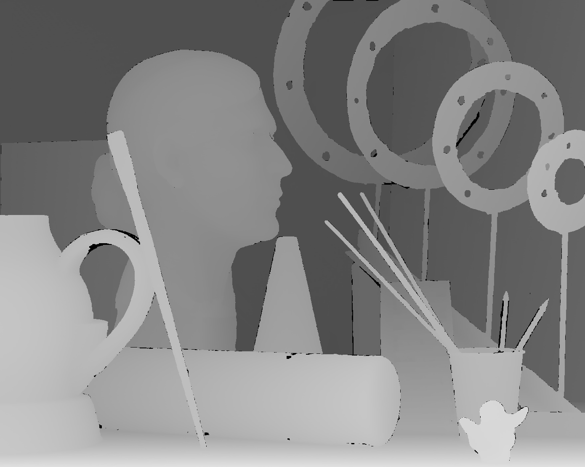

# DepthImageUpsampling

One new method for depth image upsampling.

## 1 Require

- Visual Studio 2012 or higher
- OpenCV 2.4.8 or higher

## 2 Usage

1. Open `TianSGU.sln`
2. Set your own OpenCV for Visual Studio IDE
3. Build the program and generate `TianSGU.exe`
4. Invoke `TianSGU.exe`

```cmd
D:\Github\DepthImageUpsampling\Debug\> TianSGU.exe view1.png disp1.png 2 Tianout2.png Tianbad2.png
D:\Github\DepthImageUpsampling\Debug\>
Imagescale #:2
The time of Tian method is : 15.974
BPR  : 0.515566%
MSE  : 10.0913
RMSE : 3.17669
PSNR : 38.0913
```

## 3 Result

input images:




output images:


